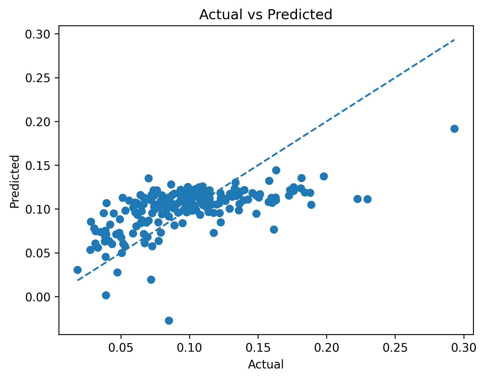

# ML_4641_Team_29

**ML 4641 Project Midterm Checkpoint**

**1. Introduction / Background**

Health insurance coverage is a critical determinant of healthcare access, preventive service utilization, and long-term health outcomes in the United States. Counties with high uninsured rates often experience poorer health outcomes, increased emergency room utilization, and greater financial strain on public health systems. Prior research has demonstrated strong associations between insurance coverage and both mortality and access to care [1], while socioeconomic determinants such as income, employment, and education significantly influence coverage disparities [2]. Additionally, geographic disparities in healthcare access remain persistent despite federal policy efforts such as the Affordable Care Act (ACA) [3].

This project will leverage county-level data from Data Commons, a publicly accessible knowledge graph aggregating U.S. Census, CDC, and other federal data sources. The primary dataset explores
“Which counties in the US have the highest rates of uninsured?”

Dataset link: [Data Commons – Uninsured Rates by County](https://datacommons.org/explore#client=ui_landing&q=Which+counties+in+the+US+have+the+highest+rates+of+uninsured)

The dataset provides county-level measures of health insurance coverage and its socioeconomic, demographic, and structural determinants. Specifically, the dataset captures:

- Insurance Coverage Metrics: Total uninsured rate and coverage breakdowns by age group.

- Demographic Composition: Population size, age distribution, racial and ethnic composition, and gender distribution.

- Socioeconomic Indicators: Median household income, poverty rate, unemployment rate, labor force participation, and educational attainment levels.

- Health and Access Proxies: Indicators related to healthcare access.

- Geographic and Structural Characteristics: Urban–rural classification, regional location, and population density.

These features enable both descriptive and predictive modeling of uninsured rates across U.S. counties. Because the dataset integrates socioeconomic and demographic indicators, it is well-suited for supervised and unsupervised machine learning approaches to uncover structural patterns and predictive relationships.

Existing literature has primarily focused on national or state-level trends [1][3], with fewer predictive modeling studies at the county level. Machine learning offers an opportunity to move beyond correlation toward identifying nonlinear relationships and clustering counties with similar risk profiles.

**2. Problem Definition**

Problem:

Can we use county-level socioeconomic and demographic features to predict and identify high-risk counties with elevated uninsured rates, and uncover structural clusters of counties with similar insurance vulnerability profiles?

We aim to predict uninsured rate as a continuous variable, classify counties into high-risk vs. low-risk categories, and identify latent clusters of counties with similar socioeconomic patterns.

Motivation:

Healthcare access inequities remain a pressing national concern. Counties with persistently high uninsured rates often overlap with economically disadvantaged or rural regions. However, policymakers typically rely on descriptive statistics rather than predictive tools.

A machine learning framework could enable early identification of at-risk counties, support data-driven policy allocation of healthcare resources, and reveal nonlinear interactions between poverty, employment, education, and insurance coverage.

Beyond predictive performance, this project contributes to sustainability and ethical governance by promoting equitable healthcare access.

**3. Methods**

Data Processing:

We collected county-level socioeconomic indicators using the data set, including total population, number of uninsured households, median household income, and unemployment rate. From these variables, we constructed a target variable, UninsuredRate, defined as the ratio of uninsured households to total population. Rows with missing or invalid values were removed to ensure data quality.

To prevent data leakage, the dataset was split into training (80%) and testing (20%) sets prior to preprocessing. Feature preprocessing was performed using a pipeline-based approach. Numerical features were imputed using the median to handle missing values and then standardized using z-score normalization (StandardScaler) to ensure consistent feature scaling. Categorical features, if present, were imputed using the most frequent value and encoded using one-hot encoding. A ColumnTransformer was used to apply these transformations in parallel, ensuring a clean and reproducible preprocessing workflow.

Model and Implementation:

As a baseline model, we implemented ElasticNetCV. ElasticNet was selected because it provides a balance between feature selection and coefficient shrinkage, which helps mitigate overfitting while maintaining interpretability. Additionally, ElasticNetCV performs internal cross-validation to automatically tune hyperparameters such as the regularization strength, reducing the need for manual tuning.

The model was integrated into a unified pipeline with the preprocessing steps, ensuring that transformations were applied consistently during both training and evaluation. Model performance was evaluated on the test set using standard regression metrics, including Mean Absolute Error (MAE), Root Mean Squared Error (RMSE), and R².

Rationale:

This approach was chosen to establish a strong and interpretable baseline while maintaining robustness against overfitting. The use of standardized preprocessing and cross-validated regularization ensures that the model generalizes reasonably well to unseen data. While ElasticNet is limited in capturing complex nonlinear relationships, it provides a reliable benchmark against which more advanced models can be compared in future work.

**4. Results and Discussion**

The ElasticNetCV model was used to predict county-level uninsured rates as a continuous outcome. The model achieved a Mean Absolute Error (MAE) of 0.027 and a Root Mean Squared Error (RMSE) of 0.035, indicating moderate prediction error. The model achieved an R² value of 0.339, suggesting that approximately 33.9% of the variance in uninsured rates is explained by the selected socioeconomic features [4].

The predicted versus actual plot demonstrates a positive linear relationship between predicted and true uninsured rates, suggesting that the model captures underlying trends in the data. However, the dispersion of points around the diagonal indicates that prediction error remains significant, particularly for counties with higher uninsured rates, where the model tends to underestimate values. Overall, the results indicate that features such as income, population, and employment provide moderate but limited predictive signal for insurance coverage disparities, though additional variables are needed to fully capture the complexity of uninsured rates across counties.

Next steps include incorporating additional demographic and healthcare-related variables and exploring nonlinear models such as Random Forest or Gradient Boosting.

**5. References**

[1] B. D. Sommers, A. E. Gawande, and K. Baicker, “Health Insurance Coverage and Health — What the Recent Evidence Tells Us,” New England Journal of Medicine, vol. 377, no. 6, pp. 586–593, 2017.
https://www.nejm.org/doi/full/10.1056/NEJMsb1706645

[2] A. S. Wilper et al., “Health Insurance and Mortality in US Adults,” American Journal of Public Health, vol. 99, no. 12, pp. 2289–2295, 2009.
https://ajph.aphapublications.org/doi/10.2105/AJPH.2008.157685

[3] K. Baicker et al., “The Oregon Experiment — Effects of Medicaid on Clinical Outcomes,” New England Journal of Medicine, vol. 368, pp. 1713–1722, 2013.
https://www.nejm.org/doi/full/10.1056/NEJMsa1212321

[4] scikit-learn developers, “Model evaluation: Quantifying the quality of predictions,” scikit-learn, 2025. [Online]. Available: https://scikit-learn.org/stable/modules/model_evaluation.html. [Accessed: 24-Feb-2026].

**Contribution Table**

| Name      | Midterm Contributions                                                                                 |
| --------- | ----------------------------------------------------------------------------------------------------- |
| Aayush P  | Wrote README.md, Research on future models (RandomForest), Gantt Chart, Updated Midterm report        |
| Jessica L | Handled missing data imputation, set up API pipeline for pulling dataset features                     |
| Mona B    | Implemented ElasticNetCV baseline model, feature scaling preprocessing, Methods section of the report |
| Jelena C  | Preprocessing Pipeline, Prevent Leakage Logic, Metric, Results and Discussion                         |
| Daanish M | Researched and tried pre-processing methods, Updated README.md                                        |

**Gantt Chart**

[Gantt Chart Midterm Checkpoint](https://docs.google.com/spreadsheets/d/1uaNblolM8ushdx9-Wmk1FDfOkJmevDDG/edit?usp=sharing&ouid=106836616759650808362&rtpof=true&sd=true)
